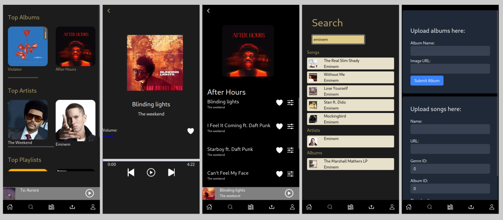

     

&nbsp;

Introducing an innovative music app akin to Spotify, yet enhanced with unique functionalities to elevate your music experience. This app not only provides access to a vast library of songs and albums from diverse genres and artists worldwide, but it also allows users to upload their own songs and albums, making it a platform for both listeners and aspiring musicians. Users can save their favorite songs, ensuring quick access to their top tracks anytime. The app's robust search capabilities enable users to find music based on artists, playlists, albums, and individual songs, ensuring a seamless and personalized search experience. Additionally, users can create and curate different playlists to suit various moods and occasions, making music management more intuitive and enjoyable. This comprehensive music app is designed to cater to all your musical needs, offering a blend of discovery, personalization, and creative freedom.

## Used technologies

Apollofy has been build using the following technologies.

-Typescript
-React
-PostgreSQL
-Express.js  
-Tailwind
